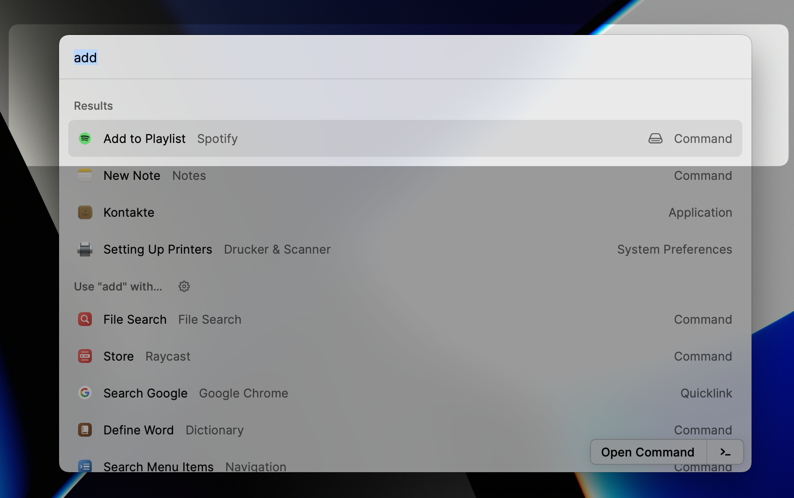
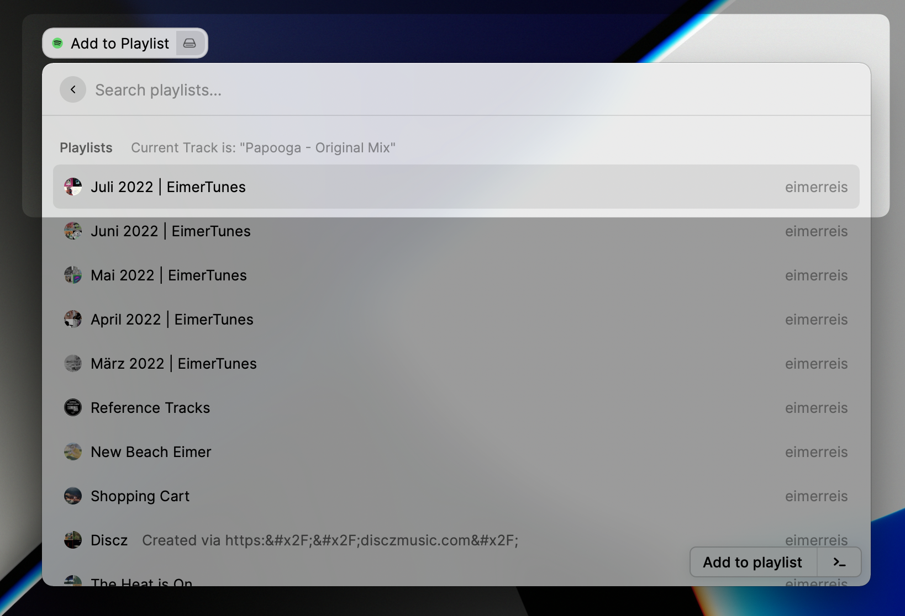

<div id="top"></div>
<!--
*** Thanks for checking out the Best-README-Template. If you have a suggestion
*** that would make this better, please fork the repo and create a pull request
*** or simply open an issue with the tag "enhancement".
*** Don't forget to give the project a star!
*** Thanks again! Now go create something AMAZING! :D
-->


<!-- PROJECT SHIELDS -->
<!--
*** I'm using markdown "reference style" links for readability.
*** Reference links are enclosed in brackets [ ] instead of parentheses ( ).
*** See the bottom of this document for the declaration of the reference variables
*** for contributors-url, forks-url, etc. This is an optional, concise syntax you may use.
*** https://www.markdownguide.org/basic-syntax/#reference-style-links
-->
<div align="center">


</div>


<!-- PROJECT LOGO -->
<div align="center">
<h2 align="center">Raycast Spotify Add To Playlist Command</h2>

  <p align="center">
    Add the current track to any of your playlists, without openning spotify
    <br />
    <a href="https://github.com/eimerreis/raycast-spotify-add-to-playlist/issues">Report Bug</a>
    ·
    <a href="https://github.com/eimerreis/raycast-spotify-add-to-playlist/issues">Request Feature</a>
  </p>
</div>


<!-- TABLE OF CONTENTS -->
<details>
  <summary>Table of Contents</summary>
  <ol>
    <li>
      <a href="#about-the-project">About The Project</a>
    </li>
    <li>
      <a href="#getting-started">Getting Started</a>
      <ul>
        <li><a href="#prerequisites">Prerequisites</a></li>
        <li><a href="#installation">Installation</a></li>
      </ul>
    </li>
    <li><a href="#roadmap">Roadmap</a></li>
    <li><a href="#contributing">Contributing</a></li>
    <li><a href="#license">License</a></li>
  </ol>
</details>


<!-- ABOUT THE PROJECT -->
## About The Project


<!--  -->

I don't like switching contexts / active windows during coding. [Raycast]() itself, already is a great enhancement to my workflow, as it simplifies lots of micro-tasks during my day and enables me to do them fully via keyboard.  
As I like to hear new music while coding I created this small command, which enables me adding new tracks I like to a playlist, without needing to open the spotfiy app itself.

<p align="right">(<a href="#top">back to top</a>)</p>


<!-- GETTING STARTED -->
## Getting Started

You can start using the extension by cloning this repository and building it on your own. You can then install it locally via raycast. To do so, navigate to `Preferences -> Extension -> + -> Add Script Directory`.

### Prerequisites

This extension comes pre-configured using the ClientId of a spotify application I created. You can always create your own application through the spotify developer portal and replace my clientId within the `preferences` array in `package.json`.

### Installation

1. Clone the repo
   ```sh
   git clone https://github.com/eimerreis/raycast-spotify-add-to-playlist.git
   ```
2. Install NPM packages
   ```sh
   npm install
   ```
3. (optional) Enter your own ClientId
   ```json
    // package.json

    {
        ...
        "preferences": [
            {
              "name": "spotifyClientId",
              ...
              "default": "INSERT-YOUR-CLIENTID-HERE"
            }
        ],
    }
   ```

<p align="right">(<a href="#top">back to top</a>)</p>


<!-- ROADMAP -->
## Roadmap

See the [open issues](https://github.com/github_username/repo_name/issues) for a full list of proposed features (and known issues).

<p align="right">(<a href="#top">back to top</a>)</p>


<!-- CONTRIBUTING -->
## Contributing

Contributions are what make the open source community such an amazing place to learn, inspire, and create. Any contributions you make are **greatly appreciated**.

If you have a suggestion that would make this better, please fork the repo and create a pull request. You can also simply open an issue with the tag "enhancement".
Don't forget to give the project a star! Thanks again!

1. Fork the Project
2. Create your Feature Branch (`git checkout -b feature/AmazingFeature`)
3. Commit your Changes (`git commit -m 'Add some AmazingFeature'`)
4. Push to the Branch (`git push origin feature/AmazingFeature`)
5. Open a Pull Request

<p align="right">(<a href="#top">back to top</a>)</p>


<!-- LICENSE -->
## License

Distributed under the MIT License. See `LICENSE.txt` for more information.

<p align="right">(<a href="#top">back to top</a>)</p>
